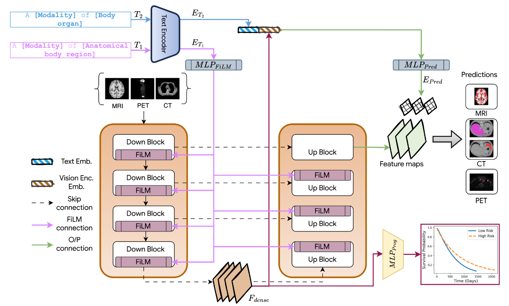
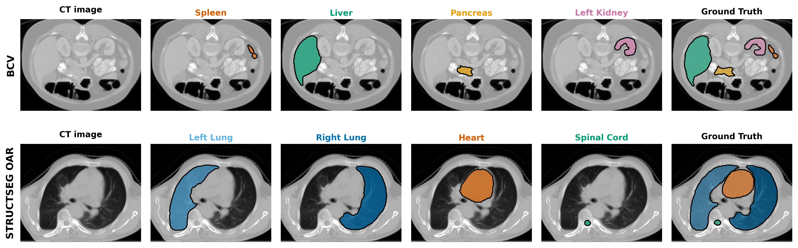

# DuPLUS: Dual-Prompt Vision-Language Framework for Universal Medical Image Segmentation and Prognosis

[](https://arxiv.org/abs/your-arxiv-id)
[](https://opensource.org/licenses/MIT)

This repository contains the official PyTorch implementation for **DuPLUS**, a novel vision-language framework for universal medical image analysis. DuPLUS uses a unique dual-prompt mechanism to control a single model for segmenting diverse anatomies across multiple modalities and seamlessly extends to prognosis prediction.



*Figure 1: The DuPLUS architecture, showcasing the dual-prompt mechanism for hierarchical text control.*


---

## 💡 Overview

Current deep learning models in medical imaging are often task-specific, limiting their generalizability and clinical utility. DuPLUS addresses these limitations with a single, unified framework that can interpret diverse imaging data and perform multiple tasks based on textual instructions.

### Key Contributions

**Hierarchical Dual-Prompt Mechanism**: DuPLUS uses two distinct text prompts for granular control:
- **T_1 (Context Prompt)**: Conditions the network's encoder-decoder on the broad context, such as imaging modality (CT, MRI, PET) and anatomical region.
- **T_2 (Target Prompt)**: Steers the prediction head to perform a specific task, such as segmenting a particular organ or tumor.

**Universal Segmentation**: A single DuPLUS model successfully segments over 30 different organs and tumors across 10 public datasets and 3 imaging modalities, outperforming task-specific and other universal models.

**Task Extensibility**: The framework is seamlessly extended from segmentation to prognosis prediction by integrating Electronic Health Record (EHR) data, achieving a Concordance Index (CI) of 0.69±0.02 on the HECKTOR dataset.

**Parameter-Efficient Adaptation**: Utilizes techniques like Low-Rank Adaptation (LoRA) to adapt to new tasks (like prognosis) by fine-tuning only a small fraction of the model's parameters.

## 🚀 Results

DuPLUS's text-driven control allows for on-the-fly changes to the model's target.



## 💾 Supported Datasets

The framework was trained and validated on 11 diverse, publicly available medical imaging datasets:

- **CT**: BCV, LiTS, KiTS, AMOS CT, StructSeg (Thorax & Head/Neck)
- **MRI**: AMOS MR, CHAOS, M&Ms, Brain Structures  
- **PET**: AutoPET

## ⚙️ Installation

### Requirements
- Python 3.8+
- PyTorch 1.12+
- CUDA-compatible GPU (16GB+ VRAM recommended for 3D training)

### Setup Environment

```bash
# Clone this repository
git clone https://github.com/your-username/DuPLUS.git
cd DuPLUS

# Create and activate a virtual environment
python -m venv venv
source venv/bin/activate  # On Windows use `venv\Scripts\activate`

# Install dependencies
pip install -r requirements.txt
```

### Install PyTorch with CUDA Support

For CUDA 11.8:
```bash
pip install torch torchvision --index-url https://download.pytorch.org/whl/cu118
```

For CUDA 12.1:
```bash
pip install torch torchvision --index-url https://download.pytorch.org/whl/cu121
```

## 🏃‍♀️ Training

### Configuration

Model and training configurations are defined in YAML files within the `config/universal/` directory. The main configuration file is `universal_resunet_3d.yaml` which includes dataset paths, model architecture parameters, and training settings.

```yaml
# In config/universal/universal_resunet_3d.yaml
arch: resunet
in_chan: 1
base_chan: 32
use_film: false  # Flag to switch between FiLM and dynamic convolution

# Dataset configuration  
dataset_name_list: ['structseg_head_oar','amos_ct', 'amos_mr', 'bcv', 'structseg_oar', 'lits', 'kits', 'mnm', 'brain_structure', 'autopet', 'chaos']
dataset_classes_list: [22, 15, 13, 13, 6, 2, 2, 3, 3, 1, 4] # number of classes per dataset

# Text embedding paths
emb_pth: './text_embeddings.pth'
meta_pth: './text_metadata.json'
emb_mod_pth: './modality_embeddings.pth'

# Training parameters
epochs: 400
training_size: [128, 128, 128]
base_lr: 0.002
optimizer: lamb
```

### Example Training Commands

The training script uses prompts defined in the configuration file to condition the model.

```bash
# Train the universal DuPLUS model
python train.py --dataset universal --model universal_resunet --dimension 3d --amp --batch_size 8 --unique_name DuPLUS_universal_run

# Train with FiLM modulation instead of dynamic convolution
python train.py --dataset universal --model universal_resunet --dimension 3d --use_film --amp --batch_size 8 --unique_name DuPLUS_film_run

# Multi-GPU training
python train.py --dataset universal --model universal_resunet --dimension 3d --gpu 0,1,2,3 --batch_size 8 --unique_name DuPLUS_multigpu_run
```

### Advanced Training Options

```bash
# Training with gradient accumulation for effective larger batch sizes
python train.py --dataset universal --model universal_resunet --dimension 3d --batch_size 4 --gradient_accumulation_steps 2 --unique_name DuPLUS_gradacc_run

# Custom experiment paths
python train.py --dataset universal --model universal_resunet --dimension 3d --cp_path ./experiments/ --unique_name DuPLUS_custom_path
```

### Model Architecture

DuPLUS uses a ResUNet backbone with dynamic feature modulation:

- `universal_resunet`: 3D ResUNet with configurable feature modulation (dynamic convolution or FiLM)

### Feature Modulation Methods

1. **Dynamic Convolution** (default): Adaptive convolution kernels with higher expressiveness
2. **FiLM (Feature-wise Linear Modulation)**: Linear transformation of feature maps with efficient parameter usage (enable with `--use_film`)

## 📊 Evaluation

The framework automatically evaluates on validation and test sets during training. Results are logged to:

- **Tensorboard logs**: `experiments/[experiment_name]/tensorboard/`
- **Text logs**: `experiments/[experiment_name]/log.txt`  
- **Model checkpoints**: `experiments/[experiment_name]/best.pth`

Metrics include:
- Dice Similarity Coefficient (DSC)
- Per-class and overall performance
- Cross-dataset generalization


## 📄 License

This project is licensed under the MIT License. See the LICENSE file for details.

## 🙏 Acknowledgments

We thank the creators of the numerous public datasets that made this work possible. This research builds upon the foundational work in vision-language models and medical image analysis from the broader scientific community.
